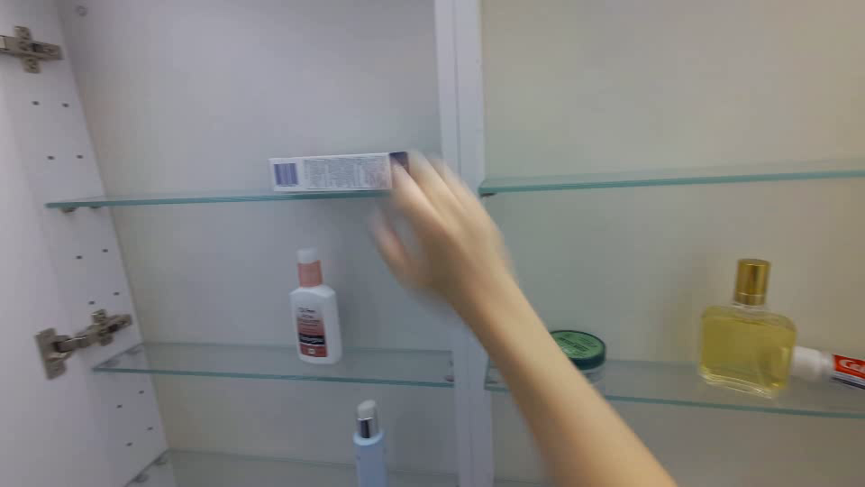
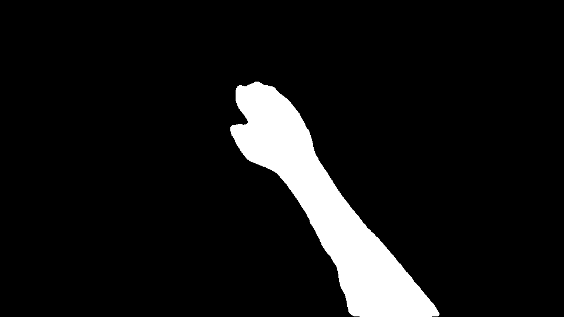
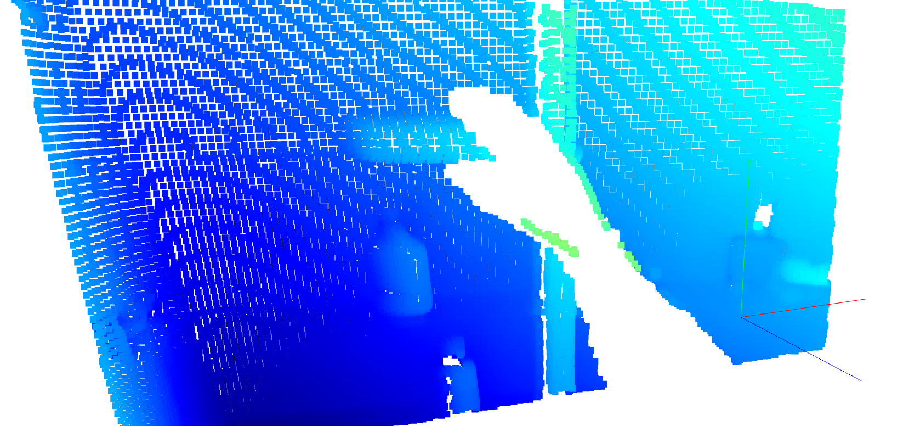

# MMTwin: New Path to Human-Robot Policy Transfer?


The code and pretrained models for our paper "Novel Diffusion Models for Multimodal 3D Hand Trajectory Prediction" will be released here. Please refer to our [paper](https://arxiv.org/abs/2504.07375) and the [project page](https://irmvlab.github.io/mmtwin.github.io) for more details.

---


<video width="100%" controls autoplay loop muted>
  <source src="docs/merged_cases_sampled.mp4" type="video/mp4">
</video>
---

We are updating the tutorials. Your patience is appreciated :)


## TODO
- [x] Release the paper  :bowtie:
- [x] Release our self-collected CABH Benchmark for fast HTP evaluation :sunglasses:      
- [ ] Release the code and pretrained models

## Suggested Data Structure

<details>
<summary>&#x1F4C1 We strongly recommend following the default data structure for fast reproducing. </summary>

```
/data/HTPdata/
|-- EgoPAT3D-postproc
 |-- odometry
 |-- trajectory_repair
 |-- video_clips_hand
 |-- pointcloud_bathroomCabinet_1  # for demo
 |-- glip_feats
 |-- motion_feats
 |-- egopat_voxel_filtered
|-- CABH-benchmark
 |-- redcup
 |-- hand_data_for_pipeline_mask_redcup
 |-- glip_feats_redcup
 |-- motion_feats_redcup
 |-- train_split.txt
 |-- test_split.txt
 |-- redapple
 |-- box
```
</details>


## Benchmark Evaluation

### EgoPAT3D

#### 0. Data Preprocessing (optional)

<details>
<summary>&#x1F527 We provide some scripts to process raw data manually. </summary>

<br> 

* 0.1 Camera Egomotion Generation 

Please refer to the config file `preprocess/CamEgoGen/ceg.yml`.  
```
cd preprocess/CamEgoGen
python generate_homography_offline.py
```

* 0.2 Vision-Language Feature Extraction

Please clone the original GLIP repo and merge it to `VLExtraction` by
```
cd preprocess
git clone https://github.com/microsoft/GLIP
rsync -a --progress GLIP/ VLExtraction/ 
cd VLExtraction
```
Then install the requirements of GLIP and modify its source code to collect vision-language fusion features as follows:

```
1. maskrcnn_benchmark/modeling/detector/generalized_vl_rcnn.py
def forward(self, 
 ...
 return result
->    return result, fused_visual_features

2. maskrcnn_benchmark/engine/predictor_glip.py
def compute_prediction(self, original_image, 
 ...
 predictions = self.model(image_list, ...
->    predictions, visual_features = self.model(image_list, ...

3. maskrcnn_benchmark/engine/predictor_glip.py
def run_on_web_image(self, 
 ...
 predictions = self.compute_prediction(original_image, ...
->    predictions, visual_features = self.compute_prediction(original_image, ...
```
After modifying the params in `preprocess/VLExtraction/vle.yml`, you can use this script to generate GLIP features for all the videos in EgoPAT3D-DT:
```
python generate_homography_offline.py
```

* 0.3 Point Cloud Aggregation

We transform sequential point clouds into a unified reference frame for voxelization. Here is a demo to aggregate them. Please refer to the config file `preprocess/PC2Voxel/p2v.yml`.  

```
cd preprocess/PC2Voxel
python generate_occupancy_offline.py
```

This is just a demo to aggregate depth points. You can also use the point clouds processed with arm masks (0.4) as inputs. Notable, our main code can automatically achieve this and save the results to the required voxel files.

* 0.4 Arm Filtering for Clean Global Context

We use MobileSAM to efficiently filter our arm point clouds for clean 3D global context. Please install the environments according to this [repo](https://github.com/ChaoningZhang/MobileSAM). Our repo has accommodated the MobileSAM repo, and you can download [MobileSAMv2](https://pan.sjtu.edu.cn/web/share/2e043be9b77d84183b2eaa97d26d7efd) and unzip it under preprocess/MobileSAM/. Remember to modify the params in `preprocess/MobileSAM/ms.yml`.  

```
cd preprocess/MobileSAM
python demo_arm_pc_filter.py
```

If you want to loop all the data in EgoPAT3D-DT, please run

```
cd preprocess/MobileSAM
python loop_arm_pc_filter_egopat3d.py
```

</details>

<div style="display: flex; justify-content: space-between; width: 100%;">
 
 
 
</div>

⬇️ Alternatively, you can directly download our preprocessed files as follows:
| Description | Link | Config |
|----------|----------|----------|
| EgoPAT3D-DT from USST | [EgoPAT3D-postproc](https://pan.sjtu.edu.cn/web/share/f2783a1b3cfca7106175e86f7e089314)  | xx | 
| camera egomotion | [motion_feats](https://pan.sjtu.edu.cn/web/share/383e0314aa1cd3348640d82b10a785f1)  | xx | 
| occupancy voxel grids | [egopat_voxel_filtered](https://pan.sjtu.edu.cn/web/share/db130ef239321f33953074f71157e01e)    | xx |
| MobileSAM requirements | [MobileSAMv2](https://pan.sjtu.edu.cn/web/share/2e043be9b77d84183b2eaa97d26d7efd)     | xx | 
| point cloud example from raw EgoPAT3D | [pointcloud_bathroomCabinet_1](https://pan.sjtu.edu.cn/web/share/f78421cdabf38c5f0fb360232d9249bd)    | xx |


#### 1. Test MMTwin on EgoPAT3D-DT

Firstly, set the GPU number and the checkpoint file in `options/traineval_config.yml`. Then you can evaluate the performance on EgoPAT3D-DT by 
```
bash val_traj.sh
```
Note that you can modify the configurations of models and experiments in `options/expopts.py`. For instance, to test MMTwin on seen scenes in 2D space, please set `test_novel=False` and `test_space="2d"`.

We have released the pretrained MMTwin models in this [link](https://pan.sjtu.edu.cn/web/share/b6fea788af3e15475562e15e8c2e82bc). Feel free to download and put it in `./mmtwin_weights/`. 

#### 2. Train MMTwin on EgoPAT3D-DT

We noticed that the performance gain from MHSA is marginal, so we omit it in this repo to improve computational efficiency. More versions will be released soon. To optimize MMTwin from scratch, simply run
```
bash train.sh
```


### CABH Benchmark

We collected multiple egocentric videos capturing human hands performing simple object manipulation tasks. This benchmark enables rapid validation of the potential of human hand trajectory prediction models for downstream manipulation applications.​​


Past trajectories are shown in green, and MMTwin’s predicted future trajectories are displayed in red. The direct detection results from the visual grounding model on future frames are visualized in blue. As can be seen, MMTwin demonstrates performance comparable to the visual grounding model even if the visual grounding model can "look into the future".

⬇️ Feel free to download the raw/preprocessed data of CABH benchmark.

| Task | Description | Link (raw) | Link (preprocessed) | Link (GLIP feats) | Link (motion info) | Link (train/test splits) |
|----------|----------|----------|----------|----------|----------|----------|
|    1     |    place the cup on the coaster     |    [hand_data_red_cup](https://pan.sjtu.edu.cn/web/share/921173eaddd9f64c609b78bcd0314174)  |  [hand_data_for_pipeline_mask_redcup](https://pan.sjtu.edu.cn/web/share/56557c9526a9c2faa37150e8eeb1bca3)  | [glip_feats_redcup](https://pan.sjtu.edu.cn/web/share/1cef4958eea97fe41c889111095c18d5)  | [motion_feats_redcup](https://pan.sjtu.edu.cn/web/share/842a707e756578fda656478e368e2f6b)  |  [train_split](https://pan.sjtu.edu.cn/web/share/f9fa399422307f7b3e32bed2f534c8ff)/[test_split](https://pan.sjtu.edu.cn/web/share/548b44a2fbfc0795020d7e51d8b52aa6)    | 
|    2     |    put the apple on the plate     |    [hand_data_red_apple](https://pan.sjtu.edu.cn/web/share/ff0e36b5db1e0192d64d5cbfb5597b5c)   |  [hand_data_for_pipeline_mask_redapple](https://pan.sjtu.edu.cn/web/share/064b9fe4e5acaca3408e1293a27eae35)   | [glip_feats_redapple](https://pan.sjtu.edu.cn/web/share/eba393250a4c960a46cb566aaa88c10c)   | [motion_feats_redapple](https://pan.sjtu.edu.cn/web/share/44b42e49e230b3cc945a020efc7597f6)   | [train_split](https://pan.sjtu.edu.cn/web/share/51236f59c34741084eef0e13378ca6ce)/[test_split](https://pan.sjtu.edu.cn/web/share/8eeca488c3212e210b1be65ca25fd128)   |
|    3     |    place the box on the shelf     |    [hand_data_box](https://pan.sjtu.edu.cn/web/share/898718217ac4b8f0640578e38f04b8d2)     |  [hand_data_for_pipeline_mask_box](https://pan.sjtu.edu.cn/web/share/56cacb8a5a65dd71dd6cf304bc6e3f19)   |  [glip_feats_box](https://pan.sjtu.edu.cn/web/share/13b67a41937e61f8048a2a805290834f)  | [motion_feats_box](https://pan.sjtu.edu.cn/web/share/2ccb8b690e92def0d6e48d3c4a4cea9c)  | [train_split](https://pan.sjtu.edu.cn/web/share/338844753b5023ff588f68030226eef9)/[test_split](https://pan.sjtu.edu.cn/web/share/7bcd035fbbb4cff348ab9cbe5d59114f)  |


* **Link (raw)**: Raw RGB and depth images from headset realsense D435i.
* **Link (preprocessed)**: Preprocessed data for HTP. Please refer to `read_cabh.ipynb` for more details.
* **Link (GLIP feats)**: Vision-language features extracted by [GLIP](https://github.com/microsoft/GLIP), a powerful visual grounding model.
* **Link (motion info)**: Camera egomotion homography.
* **Link (train/test splits)**: The dataset splits used for training and evaluation.


## Work in Progress

### CABH-E

We also collected an extension of the CABH benchmark to evaluate multi-finger prediction, which will be released soon.

### Human-Robot Policy Transfer

​​We are working on directly transferring MMTwin (trained on human motion data) to robotic manipulation, and the transfer paradigm will also be open-sourced.


🤝 If our work is helpful to your research, we would appreciate a citation to our paper:

```
@misc{ma2025mmtwin,
 title={Novel Diffusion Models for Multimodal 3D Hand Trajectory Prediction}, 
 author={Junyi Ma and Wentao Bao and Jingyi Xu and Guanzhong Sun and Xieyuanli Chen and Hesheng Wang},
 year={2025},
 eprint={2504.07375},
 archivePrefix={arXiv},
 primaryClass={cs.CV},
 url={https://arxiv.org/abs/2504.07375}, 
}
```